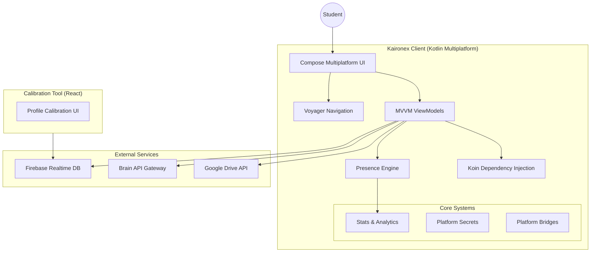
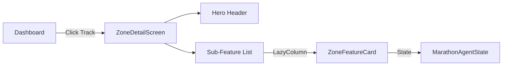
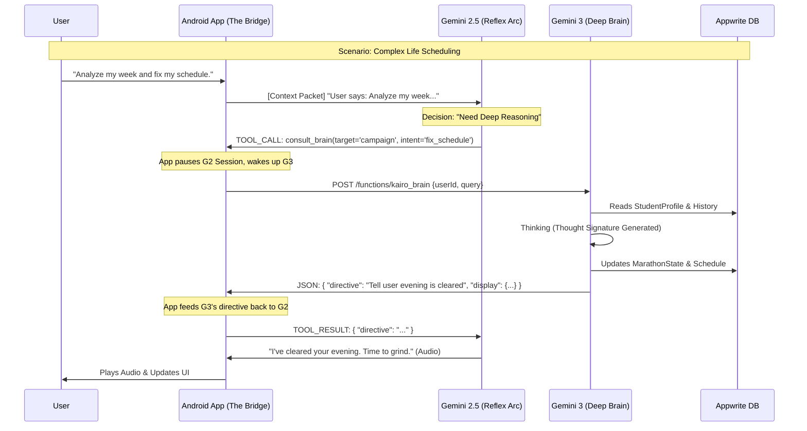

# 🤖 KAIRONEX: Student Life Operating System Architecture

## Executive Summary

Kaironex is a revolutionary **Student Life Operating System** built to bridge the "Prompt Gap" between academic rigor and life complexity. This document details the **Frontend & Client Architecture**, built on **Compose Multiplatform (KMP)**, which orchestrates life-management agents and specialized study environments.

The system is designed as a **Hyper-Personalized AI Companion** that doesn't just manage tasks but actively monitors cognitive load, pressure indices, and life stability to ensure students can maintain peak performance without burnout.

---

## 🏗️ System Architecture Overview



---

## 📁 Directory Structure

```text
Kaironex/
├── Architecture.md                 # This file
├── PROJECT_DOCUMENTATION.md        # High-level project doc
├── SYSTEM_DOCUMENTATION.md         # Detailed system requirements
│
├── composeApp/                     # 📱 Main Kotlin Multiplatform Module
│   ├── src/
│   │   ├── commonMain/             # Shared Logic & UI
│   │   │   ├── com.mursaline.kaironex/
│   │   │   │   ├── agents/         # UI for AI Agents (Study, Vitality, Radius)
│   │   │   │   ├── brain/          # API Clients & Brain Integration
│   │   │   │   ├── core/           # Presence Engine, Stats, Models
│   │   │   │   ├── di/             # Koin Modules
│   │   │   │   ├── features/       # Feature Modules (Auth, Dashboard, Genesis)
│   │   │   │   ├── platform/       # Expect/Actual definitions
│   │   │   │   └── ui/             # Theme & Components Library
│   │   │   └── App.kt              # App Entry Point
│   │   ├── androidMain/            # 🤖 Android-specific Implementation
│   │   └── jvmMain/                # 💻 Desktop-specific Implementation
│   └── build.gradle.kts            # Project Dependencies
│
├── kaironex-profile-callibration/  # 🛠️ React-based Profile Tuning Tool
│   ├── src/
│   ├── App.tsx                     # Main Logic
│   └── package.json                # React dependencies
│
└── gradle/                          # Build system configuration
```

---

## 🛠️ Technology Stack

| Layer | Technology | Purpose |
|-------|------------|---------|
| **Framework** | Compose Multiplatform | Shared UI across Android & Desktop |
| **Language** | Kotlin 2.1.0 | Primary application logic |
| **Navigation** | Voyager | Type-safe multiplatform navigation |
| **DI** | Koin | Lightweight dependency injection |
| **Networking** | Ktor | Asynchronous HTTP & WebSocket client |
| **Persistence** | Firebase / Local State | Real-time sync & configuration |
| **Design** | Material 3 + Custom | Premium "Kaironex" design system |

---

## 🧠 Core Component Deep Dives

### 1. Presence Engine (`core/presence`)
The heart of Kaironex's "Presence, Not Surveillance" philosophy. It monitors user engagement without invasive tracking.

| State | Logic | Trigger |
|-------|-------|---------|
| **FOCUSED** | User is active in the study environment | Standard state |
| **DRIFTING** | App in background > 15s | Window focus lost |
| **INTERVENTION** | App in background > 30s | Kairo "Calls" the user |
| **NEGOTIATION** | User explains delay to AI | Dialogue initiated |

### 2. Feature Modules (`features/`)
Each feature is a self-contained module containing UI, ViewModels, and specialized logic.

*   **Auth Module:** High-end glassmorphism login system with 3D card effects.
*   **Genesis Module:** Multi-step AI interview process that builds the initial `StudentProfile`.
*   **Dashboard:** The "Life Command Center" visualizing Pressure Maps and Cognitive Load.
*   **Study Room:** A protected environment with integrated document viewers and "Gatekeeper" quizzes to prevent premature context switching.

### 3. Life Support Agents (`features/zones`)
Visual interfaces for the three primary Marathon Agents, operating within the **Life Command Sector**. Each zone provides specialized tools designed to offload life's cognitive burden.

#### 🚀 The Campaign (Career & Growth)
*   **The Skill Tree:** Visual roadmap for career progression (e.g., "DSA → System Design → Cloud Cert").
*   **Quest Board:** Intelligent job aggregator filtering for "Student Friendly Hours" and "Visa Sponsorship".
*   **The Armory:** AI Resume builder that optimizes bullets against specific job descriptions.
*   **Simulacrum:** Mock interview simulation with stress-testing voice modes.

#### ⚡ The Vitality (Sustenance & Resource)
*   **Bio-Fuel System:** Smart food management with camera-based inventory and "Discount Radar".
*   **Resource Monitor:** "Runway Meter" showing financial survival days and currency support.
*   **Regen Mode:** Sleep optimizer calculating caffeine cutoff times for exam preparation.

#### 📡 The Radius (Habitat & Assimilation)
*   **Signal Decoder:** Local slang dictionary and etiquette guide for cultural integration.
*   **Safehouse:** Scam-protected rental listing analysis and utility setup guides.
*   **Local Scan:** GPS-active filter for relaxation nodes and essential services.
*   **Admin Protocol:** Visa renewal countdowns and legal work-hour trackers.

### 4. Zone UI Architecture (`features/zones`)
The "Life Command Sector" is implemented using a dynamic UI pattern that adapts to the active Life Track:



*   **Dynamic Rendering:** The `ZoneDetailScreen` consumes a `LifeTrack` enum and uses `getSubFeaturesForTrack()` to populate toolsets dynamically.
*   **Hero Header:** A track-colored branding surface that displays the zone's tagline and "Strategy Agent" identity.
*   **Contextual Actions:** Buttons adapt via `getQuickActionLabel()`, e.g., "Start Career Quest" for Campaign vs "Scan Nearby" for Radius.

---

## 📊 Data Models & State

### StudentProfile
The master data structure that defines the user's life context:
```kotlin
data class StudentProfile(
    val academic: AcademicInfo,
    val employment: EmploymentStatus,
    val goals: List<StudyGoal>,
    val bioMetrics: BioMetricSnapshot, // Sleep, Energy
    val environmental: RadiusContext   // Visa, Housing
)
```

### Marathon Agent UI State
The frontend provides transparency into the autonomous backend agents using the `MarathonAgentState` model:
*   **Objective:** The primary goal being pursued (e.g., "Finding 2-bedroom apartment near campus").
*   **Current Thought:** Real-time reasoning stream ("Analyzing utility costs for Listing A...").
*   **Status Logic:** `INITIALIZING` → `THINKING` → `EXECUTING_TOOL` → `SELF_CORRECTING`.
*   **Metrics:** Tracking tool call counts and self-correction frequency for transparency.

### Cognitive Metrics
Kaironex tracks "invisible" stats that affect student performance:
*   **Pressure Index (0-100):** Real-time stress calculation based on deadlines vs. life stability (Low/Medium/High/Peak).
*   **Concept Mastery:** A granular 0-1.0 score per subject based on "Gatekeeper" quiz performance.
*   **Study Streak & Focus Score:** Qualitative and quantitative metrics for deep-work hygiene.

---

## 🔌 The Bicameral Mind: Routing Architecture

The core of Kaironex is a **Bicameral Routing System** (App ↔ Gemini 2.5 ↔ Gemini 3). This partitions the AI's cognitive load: **Gemini 2.5 (Flash)** acts as the "Reflexive Mouth" (System 1), while **Gemini 3 (Thinking)** acts as the "Autonomous Deep Brain" (System 2).

### 1. The Interaction Flow
**The Golden Rule:** Gemini 2.5 and Gemini 3 NEVER talk directly. They communicate exclusively through the **Android App (The Bridge)**, ensuring the client remains the source of truth for user state.



### 2. Protocol Specification

#### A. The "Context Packet" (App ➔ Gemini 2.5)
To eliminate latency-heavy "Who are you?" turns, the app injects a hidden system state on every connection open:
```json
{
  "role": "system",
  "content": "STU_CONTEXT: User:Mursaline, Zone:Library, Energy:Crit(3h), ActiveQuest:CompilerProj"
}
```

#### B. The Router Tool (`consult_brain`)
Gemini 2.5 is strictly programmed to serve as a router using function calling:
```kotlin
// Tool Definition in GeminiReasoningEngine
val tools = listOf(
    Tool(
        name = "consult_brain",
        description = "Call for database writes, deep research, or career planning.",
        parameters = mapOf(
            "target_agent" to "vitality|campaign|study",
            "user_intent" to "detailed string"
        )
    )
)
```

### 3. Trillion-Dollar Backend Architecture (Proactive Loop)
Kaironex moves beyond "Request-Response" into **Event-Driven Cognitive Agency**.

| Component | Tech | Logic |
|-----------|------|-------|
| **Nervous System** | Appwrite Realtime | Sub-50ms state syncing for rapid UI updates. |
| **Reflex Arc** | Gemini 2.5 (Live API) | Handles audio-to-text normalization and "Mouth" responses. |
| **Deep Brain** | Gemini 3 (Appwrite Functions) | **System 2:** Performs multi-step planning and database updates. |
| **Memory Fabric** | Appwrite DB (JSON) | Persistent `studentState_json` and `agent_memory` tables. |
| **Supervision** | CRON Orchestrator | **Autonomous Loop:** Checks for "Drift" every 10 mins while user is idle. |

### 4. Zero-Click Proactive Intervention
The **Supervisor Agent** (running 24/7 in Appwrite Functions) monitors the `Vitality` and `Pressure` indices. If `Drift > 4h` AND `Exam < 48h`, the Brain initiates an **Unprompted Intervention**:
1. Brain writes a `CrisisProtocol` flag to the DB.
2. App receives Realtime update.
3. App triggers the **Gemini Intervention Overlay** automatically, even if the phone is idle.

---

## 🎨 Design System

Kaironex uses a **Premium Neo-Skeuomorphic** design language:
*   **Primary Palette:** Electric Blue (`#2563EB`) & Gemini Blurple (`#6366F1`).
*   **Typography:** Material 3 Scale using modern sans-serif fonts.
*   **Components:** Custom `KxOrb`, `KxCard`, and `KxButton` variants with built-in micro-animations.

---

## 🚀 Deployment & Roadmap

1.  **Phase 1 (Current):** KMP Core, MVVM setup, and UI System implementation.
2.  **Phase 2:** Full integration with the Marathon Agent Orchestrator.
3.  **Phase 3:** Real-time Voice Interaction (STT/TTS) and Gemini Live API.
4.  **Phase 4:** iOS & Web targets via Compose Multiplatform.

---

> [!IMPORTANT]
> This document describes the **Client-Side Architecture**. For the backend reasoning and agent orchestration logic, refer to the **Kaironex-Brain** internal documentation (Excluded from this scope).
