# 🧠 Kaironex Deep Brain — Backend Architecture

> **The Marathon Agent that never sleeps.**  
> An autonomous executive-function layer that plans, reasons, self-corrects, and operates across hours and days — not just single prompts — to close the **Prompt Gap**: the moment students most need help but lack the clarity or capacity to ask for it.

---

## Table of Contents

1. [Why Kaironex Exists](#1-why-kaironex-exists)
2. [System Overview — The Three-Brain Architecture](#2-system-overview--the-three-brain-architecture)
3. [Gemini 3 Integration Map](#3-gemini-3-integration-map)
4. [The Continuous Marathon Loop](#4-the-continuous-marathon-loop)
5. [The Marathon Agent Pattern](#5-the-marathon-agent-pattern)
6. [Thought Signatures — The Memory of Reasoning](#6-thought-signatures--the-memory-of-reasoning)
7. [The Bicameral Engine — How Kaironex Thinks](#7-the-bicameral-engine--how-kaironex-thinks)
8. [Entry Point & Routing](#8-entry-point--routing)
9. [Agent Architecture — Five Autonomous Brains](#9-agent-architecture--five-autonomous-brains)
   - [Study Agent — Academic Strategist](#study-agent--academic-strategist)
   - [Vitality Brain — Life Logistics Engine](#vitality-brain--life-logistics-engine)
   - [Campaign Agent — Career Strategist](#campaign-agent--career-strategist)
   - [Radius Agent — Cultural Survival Engine](#radius-agent--cultural-survival-engine)
   - [Supervisor Agent — Meta-Controller](#supervisor-agent--meta-controller)
10. [Two-Layer Hierarchical Scheduling](#10-two-layer-hierarchical-scheduling)
11. [Cross-Agent Integration — Agents That Talk](#11-cross-agent-integration--agents-that-talk)
12. [The Orchestration Pipeline](#12-the-orchestration-pipeline)
13. [State Machine — Agent Lifecycle](#13-state-machine--agent-lifecycle)
14. [The DEFCON Survival Protocol](#14-the-defcon-survival-protocol)
15. [Function Calling & Tool System](#15-function-calling--tool-system)
16. [Live API Voice Integration](#16-live-api-voice-integration)
17. [Database Schema — 20 Living Collections](#17-database-schema--20-living-collections)
18. [Project Structure](#18-project-structure)
19. [Test Suite & Judge Testing Guide](#19-test-suite--judge-testing-guide)

---

## 1. Why Kaironex Exists

### The Prompt Gap

Education today piles responsibilities onto students until the system outpaces what any one person can manage. Globally, **1.5+ billion learners** navigate crowded curricula and life obligations. About **260 million** are in tertiary education, and roughly **30% of university students leave before getting a degree**. Almost **1 in 4 drop out during the first year**. In the U.S. alone, 43 million adults hold "Some College, No Degree."

These students aren't failing from lack of ability — they're failing because **life and study collide**:

- **60%+ of students work while studying** — shifting schedules break plans
- **6.9 million international students** face harsher stakes: a single GPA drop can mean lost scholarships, visa cancellation, or forced withdrawal
- When overload hits, students don't open planners or chatbots — they **freeze, panic, or fall silent**

That moment is the **Prompt Gap**: when a student most needs help but lacks the clarity or capacity to request it. Existing tools assume the user can still act. They wait for prompts. But the exact people who most need support are the ones who **can't prompt**.

The real failure is not content delivery — it's the absence of **continuous, proactive executive support**: a system that understands classes, work, fatigue, deadlines, and finances, and steps in **before** short-term overload becomes a permanent loss.

Every college and university student faces this intersection:
- **Study** (exams, assignments, focus management, resource ingestion)
- **Survive** (budgets, meals, emergency funds, financial runway)
- **Find work** (ATS-optimized resumes, mock interviews, skill trees, job scanning)
- **Navigate life** (culture shock for internationals, schedule conflicts, life events, exhaustion)

No single prompt can solve this. No chatbot can sustain it. This requires an **autonomous marathon agent** — one that wakes you up with a morning briefing, plans your meals around your budget, detects when your focus drops mid-study, rewrites your resume when a job posting matches your skills, and steps in during the Prompt Gap. All without you asking.

**Kaironex is that agent — built for every student, from first-year freshman to international PhD candidate.**

---

## 2. System Overview — The Three-Brain Architecture

Kaironex uses a **3-model cognitive architecture** inspired by neuroscience's dual-process theory, extended into a tri-layer system:

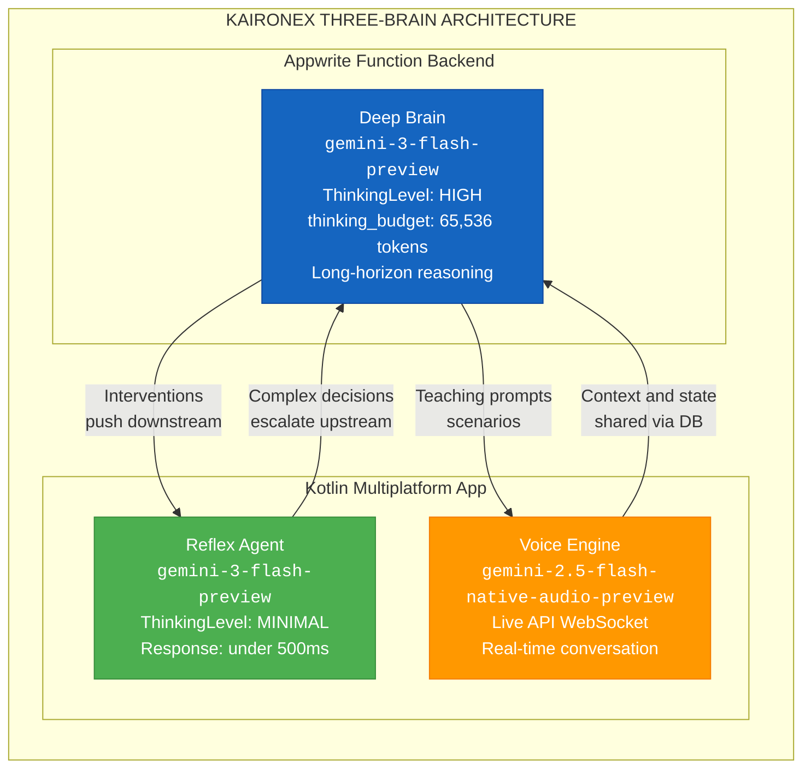

| Layer | Model | Thinking Budget | Purpose | Latency |
|-------|-------|----------------|---------|---------|
| **Deep Brain** (this backend) | `gemini-3-flash-preview` | 8,192 — 65,536 tokens (per agent) | Long-horizon planning, marathon steps, ATS analysis, intervention generation | 2–8s |
| **Reflex Agent** (mobile app) | `gemini-3-flash-preview` | MINIMAL | Instant UI responses, quick pattern matching, chat | <500ms |
| **Voice Engine** (mobile app) | `gemini-2.5-flash-native-audio-preview-12-2025` | — | Live API WebSocket for real-time teaching, mock interviews, cultural scenario practice | Real-time streaming |

> The same `gemini-3-flash-preview` model serves two cognitive layers — fast reflexes on mobile and deep reasoning on the backend — differentiated purely by **Thinking Level configuration**, not model swaps.

### Model Specifications

| Spec | `gemini-3-flash-preview` | `gemini-2.5-flash-native-audio-preview-12-2025` |
|------|--------------------------|--------------------------------------------------|
| **Input tokens** | 1,048,576 (1M) | — |
| **Output tokens** | 65,536 | — |
| **Thinking** | ✅ Supported | — |
| **Function calling** | ✅ Supported | — |
| **Google Search grounding** | ✅ Supported | — |
| **Structured outputs (JSON)** | ✅ Supported | — |
| **Vision / Multimodal** | ✅ Supported | — |
| **Code execution** | ✅ Supported | — |
| **Caching** | ✅ Supported | — |
| **URL context** | ✅ Supported | — |
| **Live API** | ❌ NOT supported | ✅ Native audio streaming |

### Per-Agent Thinking Budgets (from source code)

All agents run at the **maximum thinking budget of 65,536 tokens** — the full output token limit of `gemini-3-flash-preview`. This ensures every reasoning call gets the deepest possible thinking, whether it's a cultural lesson or a full semester schedule.

| Agent | Thinking Budget | Reasoning Mode |
|-------|----------------|----------------|
| **Study Agent** | 65,536 tokens | MARATHON (DEEP + checkpoints) |
| **Campaign Agent** | 65,536 tokens | DEEP |
| **Radius Agent** | 65,536 tokens | MARATHON (HYBRID reasoning) |
| **Supervisor Agent** | 65,536 tokens | HYBRID |
| **Vitality Agent** | 65,536 tokens | HYBRID |
| **BicameralEngine** (default) | 65,536 tokens | All modes |
| **GeminiClient** (all calls) | 65,536 tokens | Direct API calls |
| **SurvivalProtocol** | 65,536 tokens | Financial + fridge vision |
| **DeepBrain** | 65,536 tokens | Deep reasoning interface |

> **Why max budget everywhere?** Gemini 3 Flash Preview supports up to 65,536 output tokens. The thinking budget controls how deeply the model reasons before producing output. By setting every agent to the maximum, we ensure the AI never truncates its reasoning — whether it's scoring a resume, planning a semester, or analyzing fridge contents. Cost is not a concern for a hackathon demo; reasoning quality is everything.

---

## 3. Gemini 3 Integration Map

Every AI call in Kaironex flows through `gemini-3-flash-preview`. Here is exactly where and how:

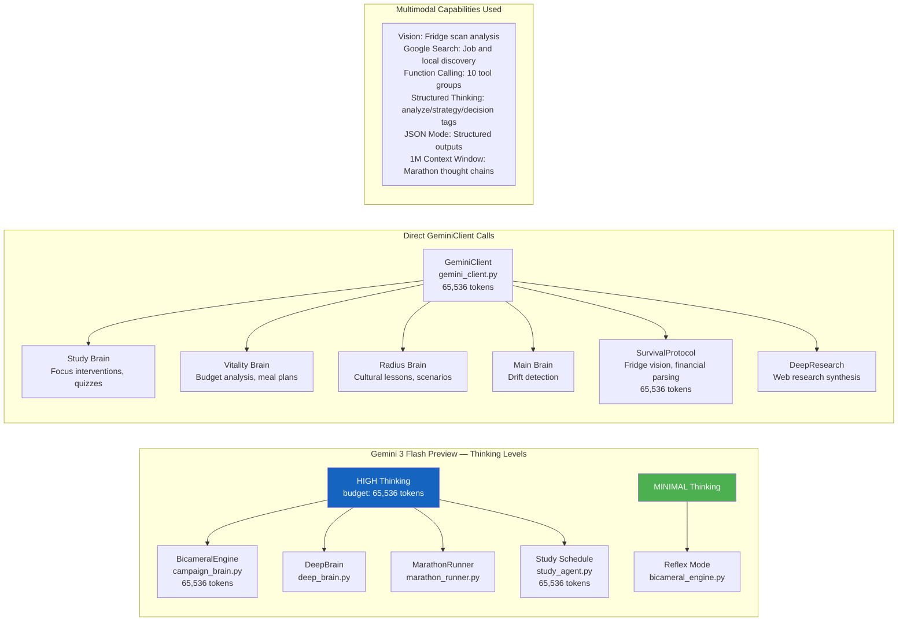

### Gemini 3 Features Used

| Feature | Where Used | Technical Detail |
|---------|-----------|------------------|
| **Thinking Mode (HIGH)** | `BicameralEngine`, `DeepBrain`, `MarathonRunner`, `StudyAgent` | All agents at 65,536 tokens, structured `<analyze>/<strategy>/<decision>/<action>` extraction |
| **Thinking Mode (MINIMAL)** | `BicameralEngine.reflex_generate()`, mobile Reflex Agent | Fast pattern matching, <500ms |
| **Function Calling** | `BicameralEngine.reason_with_tools()` | 10 tool groups, up to 5 iterative tool-call loops per reasoning step |
| **Google Search Grounding** | `campaign_brain.scan_daily_jobs()`, `search_tools.py` | Real-time job discovery, local services, career research |
| **Vision / Multimodal** | `SurvivalProtocol.analyze_fridge()`, `gemini_client.generate_multimodal()` | Fridge photo → ingredient inventory → meal suggestions |
| **JSON Mode** | All brain outputs, quiz generation, ATS scoring | Structured `response_mime_type="application/json"` |
| **1M Context Window** | `ThoughtManager` injects previous reasoning chain | Full marathon thought chain context for multi-step reasoning |
| **Structured Output** | `campaign_brain` resume/interview/skill_tree generation | Complex nested JSON schemas for career artifacts |

### Where `gemini-2.5-flash-native-audio-preview-12-2025` Is Used

The **Gemini Live API** with native audio runs on the **mobile app** (Kotlin Multiplatform) for:

| Feature | Description |
|---------|-------------|
| **Cultural Scenario Practice** | Radius Brain generates cultural scenarios → Voice Engine acts them out in real-time conversation with the student |
| **Mock Interview Sessions** | Campaign Brain designs interview question banks → Voice Engine conducts the mock interview as a live audio conversation |
| **Live Teaching Prompts** | Radius Brain creates `live_agent_prompt` data → Voice Engine uses it for interactive language/culture teaching |
| **Real-Time Tutoring** | Study Brain topics → Voice Engine explains concepts conversationally |

> The Deep Brain (this backend) generates the **content and structure** for voice sessions. The mobile app's Voice Engine then **delivers** them through the Live API WebSocket, creating a seamless brain-to-voice pipeline.

---

## 4. The Continuous Marathon Loop

Kaironex runs **continuously**. Not for 72 hours. Not as a one-shot. It is always on, always watching, always adapting.

```
                    ┌──────────────────────┐
                    │   STUDENT SIGNS UP    │
                    │   (Day Zero)          │
                    └──────────┬───────────┘
                               ▼
                    ┌──────────────────────┐
                    │  CALIBRATION PHASE    │
                    │  • Profile extraction │
                    │  • Constitution build │
                    │  • Financial setup    │
                    │  • Cultural profile   │
                    │  • Career calibration │
                    │  • Semester schedule  │
                    └──────────┬───────────┘
                               ▼
          ┌────────────────────────────────────────┐
          │                                        │
          │         THE CONTINUOUS LOOP             │
          │                                        │
          │    ┌───────────────────────┐            │
          │    │  CRON: MORNING        │            │
          │    │  • Budget check       │            │
          │    │  • Meal planning      │◄───────┐   │
          │    │  • Cultural lesson    │        │   │
          │    │  • Daily briefing     │        │   │
          │    └──────────┬────────────┘        │   │
          │               ▼                     │   │
          │    ┌───────────────────────┐        │   │
          │    │  STUDENT LIVES DAY    │        │   │
          │    │  • Study sessions     │        │   │
          │    │  • Location changes   │        │   │
          │    │  • Meals logged       │        │   │
          │    │  • Focus tracked      │        │   │
          │    │  • Events happen      │        │   │
          │    └──────────┬────────────┘        │   │
          │               ▼                     │   │
          │    ┌───────────────────────┐        │   │
          │    │  AGENTS RESPOND       │        │   │
          │    │  • Interventions      │        │   │
          │    │  • Drift detection    │        │   │
          │    │  • Schedule adapt     │        │   │
          │    │  • Emergency help     │        │   │
          │    └──────────┬────────────┘        │   │
          │               ▼                     │   │
          │    ┌───────────────────────┐        │   │
          │    │  CRON: EVENING        │        │   │
          │    │  • Day summary        │        │   │
          │    │  • Savings allocation  │        │   │
          │    │  • Tomorrow prep      │        │   │
          │    │  • Weekly digest      │        │   │
          │    └──────────┬────────────┘        │   │
          │               ▼                     │   │
          │    ┌───────────────────────┐        │   │
          │    │  SUPERVISOR CHECK     │        │   │
          │    │  • Cross-domain health│        │   │
          │    │  • Pressure level     │        │   │
          │    │  • Drift detection    │        │   │
          │    │  • Agent coordination │        │   │
          │    └──────────┬────────────┘        │   │
          │               │                     │   │
          │               └─────────────────────┘   │
          │         (REPEAT EVERY DAY FOREVER)       │
          │                                          │
          │    ┌─────────────────────────────┐       │
          │    │  MONTHLY: NEW MONTH BEGINS  │       │
          │    │  • Next month daily schedule │       │
          │    │  • Re-evaluate semester plan │       │
          │    │  • Adaptation from last month│       │
          │    └─────────────────────────────┘       │
          │                                          │
          └────────────────────────────────────────┘
```

Every cycle feeds into the next. Morning routine produces context for the day. The day produces events for agents. Agents produce interventions. Evening summarizes. Supervisor checks cross-domain health. Next morning starts again. Monthly, the semester plan is re-evaluated and next month's daily schedule is generated based on what happened.

This is not a pipeline. It is a **continuous feedback loop** with no termination point until the semester ends.

---

## 5. The Marathon Agent Pattern

This is the core of what makes Kaironex a **Marathon Agent** — not a chatbot.

### What Makes It Marathon

A Marathon Agent operates **autonomously across hours and days**, maintaining reasoning continuity through:

1. **Thought Chains** — Every AI reasoning step produces a `ThoughtSignature` linked to its parent, forming an unbroken chain of reasoning across time
2. **Persistent State** — Agent state survives process restarts via Appwrite database
3. **Self-Correction** — Confidence scoring triggers escalation from REFLEX → DEEP when the agent is uncertain
4. **Proactive Execution** — Agents fire without user input: morning routines, drift detection, end-of-day summaries
5. **Multi-Step Decomposition** — Complex goals are broken into 5–15 steps, each executed with full reasoning context

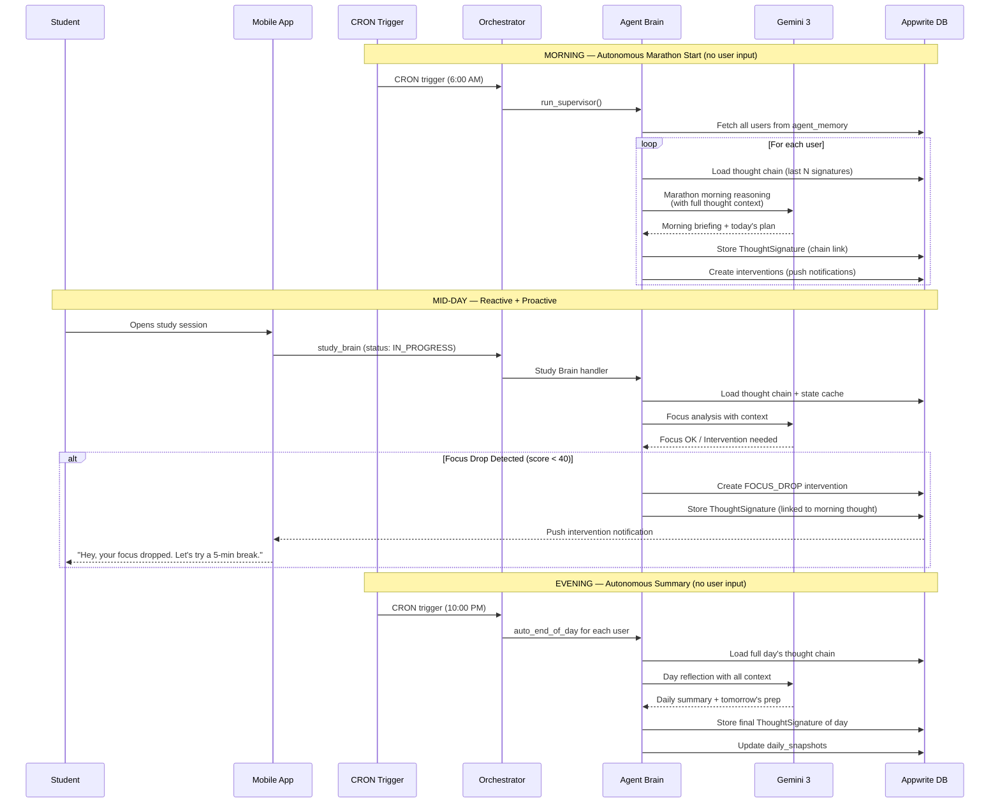

### Marathon Runner — Multi-Step Task Execution

For complex goals (e.g., "Prepare me for a Google SWE interview in 30 days"), the `MarathonRunner` decomposes and executes:

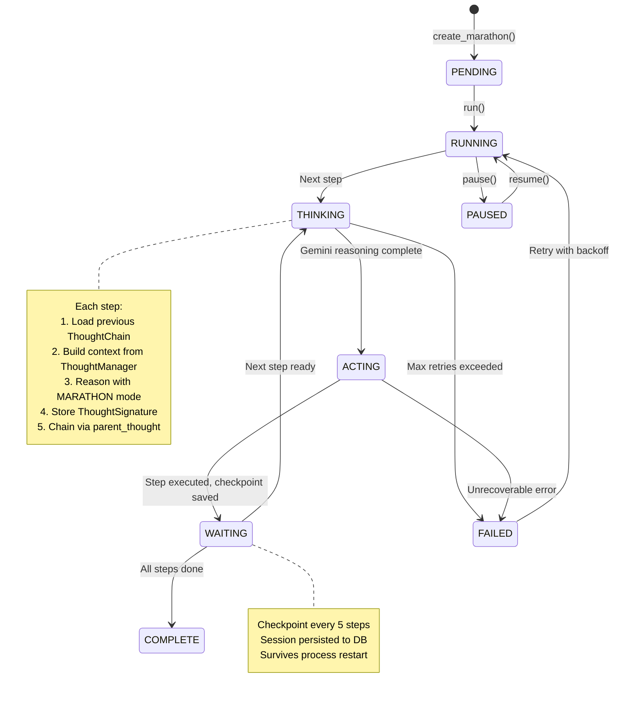

**Configuration:**
- Steps per marathon: 5–15 (decomposed by DEEP reasoning)
- Step timeout: 300 seconds
- Max retries per step: 3 (exponential backoff)
- Checkpoint interval: Every 5 steps
- Reasoning mode: `ReasoningMode.MARATHON`

---

## 6. Thought Signatures — The Memory of Reasoning

The **ThoughtSignature** is Kaironex's core innovation for marathon continuity. Every AI reasoning call produces one, and they chain together to form an unbroken record of **why** the system made every decision.

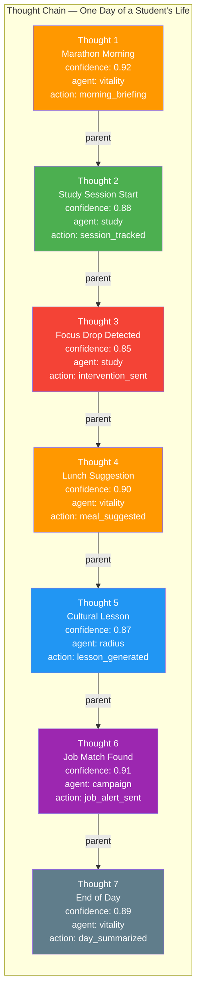

### ThoughtSignature Schema

```python
@dataclass
class ThoughtSignature:
    thought_id: str           # "thought_a1b2c3d4e5f6" (unique per reasoning step)
    timestamp: datetime       # When this thought occurred
    user_id: str              # Which student
    agent: str                # Which brain (study/vitality/campaign/radius)
    context_hash: str         # SHA-256(user_id:prompt:timestamp)[:16] — integrity check
    reasoning_trace: List[str] # Extracted <analyze>, <strategy>, <decision> tags
    confidence: float         # 0.1–1.0 (triggers escalation if < 0.7)
    tool_calls: List[str]     # Names of tools called during reasoning
    action_output: str        # Final action taken
    parent_signature: str     # Links to previous thought → forms the chain
```

### How Continuity Works

1. **Creation**: Every Gemini call → ThoughtSignature with unique ID + SHA-256 context hash
2. **Chaining**: Each new thought links to its `parent_signature`, forming an unbroken chain
3. **Storage**: Dual-write to `thought_signatures` (permanent ledger) AND `agent_memory` (fast lookup)
4. **Injection**: `ThoughtManager.get_reasoning_context()` reads last N thoughts and injects them as `=== PREVIOUS REASONING CONTEXT ===` into the next Gemini prompt
5. **Pressure Analysis**: `ThoughtManager.compute_pressure_index()` analyzes thought frequency and declining confidence patterns to detect student stress

> **Why this matters for Marathon Agents**: A chatbot forgets between messages. Kaironex's thought chain means the 10 PM end-of-day summary has full context of the 6 AM morning plan, the mid-day focus drop, and the afternoon cultural lesson — all linked through thought signatures.

---

## 7. The Bicameral Engine — How Kaironex Thinks

Named after Julian Jaynes' bicameral mind theory, the engine implements **dual-process cognition**:

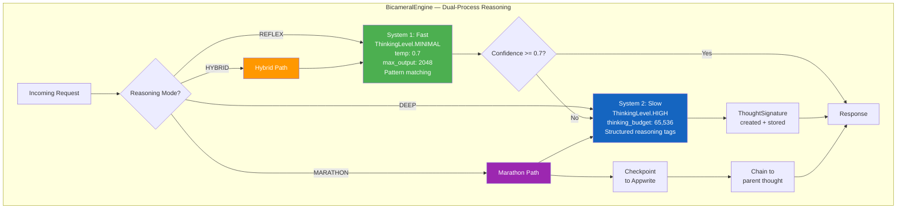

### Reasoning Modes

| Mode | Thinking Level | Use Case | Example |
|------|---------------|----------|---------|
| `REFLEX` | MINIMAL | Quick responses, simple lookups | "What's my study streak?" |
| `DEEP` | HIGH (65,536 tokens) | Complex analysis, career strategy | ATS resume scoring, interview design |
| `HYBRID` | MINIMAL → HIGH | Uncertain situations | Start fast, escalate if confidence < 0.7 |
| `MARATHON` | HIGH + checkpoints | Multi-step autonomous tasks | 30-day interview prep plan |

### Structured Thinking Tags

When operating in DEEP or MARATHON mode, the engine prompts Gemini to use structured reasoning:

```
<analyze>What is the student's current situation?</analyze>
<strategy>What approach should we take?</strategy>  
<decision>What specific action do we commit to?</decision>
<action>Execute the decided action</action>
```

These tags are extracted into `reasoning_trace` in the ThoughtSignature, creating an auditable trail of **how** the AI reasoned — not just what it output.

---

## 8. Entry Point & Routing

**File:** `src/main.py` (~230 lines)

The backend runs as an **Appwrite Function** — no HTTP server, no FastAPI. Appwrite triggers execution based on:

### Trigger Types

| Trigger | Source | Routes To |
|---------|--------|-----------|
| Database: `users` collection | Profile created/updated | Campaign Agent (if resources exist) |
| Database: `resources` collection | File uploaded | Study Agent (resource ingestion) |
| Database: `study_logs` collection | Study session event | Study Agent |
| Database: `vitality_state` collection | Vitality event | Vitality Brain |
| Database: `radius_state` collection | Radius event | Radius Agent |
| Database: `schedule`/`campaign` | Schedule/campaign change | Campaign Agent |
| CRON | Scheduled timer | Supervisor Agent |
| HTTP: `POST /brain/deep` | App → backend deep request | Routes to specified agent |
| HTTP: `POST /campaign` | Direct campaign request | Campaign Agent |
| HTTP: `GET /state` | State sync request | Returns user state |
| HTTP: `GET /health` | Health check | Returns status |

### Routing Flow

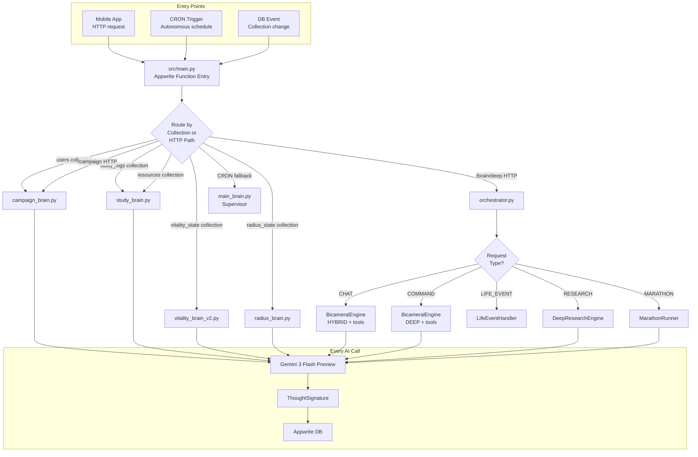

---

## 9. Agent Architecture — Five Autonomous Brains

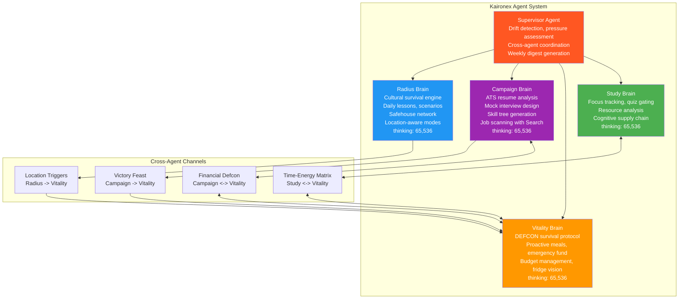

---

### Study Agent — Academic Strategist

**File:** `src/agents/study_agent.py` (1,263 lines)  
**Mode:** MARATHON (DEEP + checkpoints)  
**Thinking:** 65,536 tokens default — **65,536 tokens** for schedule generation

The Study Agent owns the student's entire academic timeline. It doesn't just make schedules — it extracts the student's **Constitution** (immutable life constraints), builds a **semester-wide strategy**, generates **daily tactical plans**, and prepares **Just-In-Time content** for every task.

#### Capabilities

| Handler | What It Does |
|---------|--------------|
| `schedule_request` | **Full hierarchical planning** at **65,536 thinking tokens**. Extracts UserConstitution (job hours, prayer blocks, energy pattern, learning pace, weakness subjects, academic goals). Builds semester timeline. Generates TWO layers in a SINGLE API call: Layer 1 = monthly strategy for entire semester, Layer 2 = daily tasks for current month. Calculates study hours from CGPA target. Respects all blocked times. Triggers JIT content preparation after schedule generation. |
| `content_request` | **On-demand JIT content.** Returns pre-generated study content by taskId or date. Content modes: `deep_dive` (full learning), `travel` (mobile-friendly), `cram` (pre-exam), `practice` (exercises). |
| `resource_ingestion` | **Resource processing.** Accepts uploaded PDFs, documents, and links. Passes to Gemini for AI analysis. Extracts key concepts, summaries, and study recommendations. Creates intervention with analysis results. |
| Focus tracking | When `status=IN_PROGRESS` and `focus_score < 40`, generates a focus intervention. Above 40, logs normally. |
| `REQUEST_UNLOCK` (quiz) | Generates quiz questions to gate topic progression. Student must demonstrate understanding before moving to next topic. |
| State caching | Every event updates the agent memory state cache with study session data, actions taken, and timestamps. |
| Heartbeat logging | Every study session event is logged for drift detection and progress tracking. |

#### UserConstitution (extracted once, immutable)

```
Job Schedule → blocked work hours
Prayer Blocks → blocked prayer times
Health Routine → gym/exercise windows
Energy Pattern → night owl or early bird → peak study hours
Learning Pace → affects task density
Weakness Defense → subjects needing more time
Academic Goal → target CGPA → required study hours calculation
```

#### Two-Layer Planning (Single API Call at 65,536 Thinking Tokens)

```
Layer 1 — STRATEGY (Semester-wide):
  Month 1: [subjects, topics, weights, exam prep windows]
  Month 2: [subjects, topics, weights, exam prep windows]
  ... (all months until semester end)

Layer 2 — TACTICAL (Current month daily):
  Day 1: [task1{subject, topics, difficulty, content_mode, objectives}, task2, ...]
  Day 2: [task1, task2, ...]
  ... (all days in current month)
```

**Smart date handling:** If a student signs up mid-semester, planning starts from TODAY, not from semester start.

#### Just-In-Time Content via ProactiveContentEngine

**File:** `src/tools/proactive_content_engine.py` (839 lines)

After schedule generation, the engine pre-generates study content for upcoming tasks. Content modes:

- **deep_dive** — Comprehensive learning material with explanations, examples, and practice
- **travel** — Mobile-optimized bite-sized content for commuting
- **cram** — Condensed review material for pre-exam periods
- **practice** — Problem sets and exercises for skill building

#### Daily Content Generator — Gatekeeper Quiz System

**File:** `src/tools/daily_content_generator.py`

The Daily Content Generator creates AI-powered learning materials for each scheduled study task. It populates three new schedule table fields:

| Field | Size | Content |
|-------|------|---------|
| `just_in_time_resources` | 100KB | JSON array of 5-8 text-based resources (white UI friendly) |
| `flash_cards` | 20KB | JSON array of 8-12 flashcards with front/back structure |
| `macro_quizes` | 20KB | Gatekeeper quiz with 5-7 questions (70% to pass) |
| `quiz_result` | 10KB | Quiz attempt result (written by app, read by AI) |

**Gatekeeper System:** Students MUST pass the daily quiz (70% score) to unlock the next day's content. Failed quizzes are logged to `quiz_result` for Gemini to analyze and potentially reschedule topics.

**Usage:**

```python
# As module (called by Study Agent or scheduled function)
from src.tools.daily_content_generator import DailyContentGenerator
generator = DailyContentGenerator()
generator.process_user_daily_content(user_id="user_123", target_date="2026-02-09")

# CLI for manual testing
python -m src.tools.daily_content_generator --user demo_user_001 --date 2026-02-09

# Process all active users (scheduled Appwrite Function)
generator.process_all_users_daily_content(target_date="2026-02-09")
```

**Resource Format (part-by-part, not monolithic):**

```json
[
  {"id": "resource_1", "name": "Introduction", "type": "concept", "content": "...", "estimated_read_time": 3},
  {"id": "resource_2", "name": "Key Definitions", "type": "key_points", "content": "...", "estimated_read_time": 2},
  {"id": "resource_3", "name": "Worked Example", "type": "example", "content": "...", "estimated_read_time": 4}
]
```

---

### Vitality Brain — Life Logistics Engine

**File:** `src/agents/vitality_brain_v2.py` (1,650 lines)  
**Style:** Functional dispatch (not class-based)  
**Mode:** Per-handler basis  
**Thinking:** 65,536 tokens

The Vitality Brain handles everything that isn't academic — finances, food, sleep, energy, wellness. It operates on a **DEFCON system** for financial urgency and a **decision matrix** for daily choices. It runs autonomous morning and evening routines.

#### Capabilities

| Handler | What It Does |
|---------|--------------|
| `one_shot_setup` | **Day Zero financial calibration.** Parses income sources, bills, rent, subscription costs. Calculates daily budget runway. Sets DEFCON level (1-5). Creates survival state document. |
| `fridge_scan` | **Gemini Vision analysis.** Student photographs fridge contents → Gemini identifies ingredients → generates meal suggestions with estimated costs within DEFCON budget. |
| `proactive_meal_plan` | **AI-generated meal options.** Produces 3 meal options per slot (breakfast/lunch/dinner) that fit the daily budget. Considers DEFCON level, available ingredients, and time constraints. |
| `select_meal_option` | **Meal selection.** Student picks from generated options. Updates daily spending tracker. |
| `get_todays_meals` | **Current meal plan status.** Returns today's planned and consumed meals with remaining budget. |
| `daily_budget_check` | **Morning financial ritual.** Calculates today's available budget. Shows runway (days until broke). Generates spending guidance based on DEFCON level. |
| `defcon_update` | **Financial urgency recalculation.** Recalculates DEFCON after income received, unexpected expense, or budget change. |
| `cross_agent_sync` | **Multi-agent state sync.** Pushes vitality state to other agents so they can adjust. |
| `marathon_morning_routine` | **AUTONOMOUS morning routine.** Runs without user input: budget check → meal planning → energy assessment → daily briefing. |
| `auto_end_of_day` | **AUTONOMOUS evening routine.** Day summary → savings auto-allocation (if surplus) → tomorrow preparation → writes intervention. |
| `emergency_fund_withdraw` | **Emergency fund access.** Validates amount, checks fund balance, processes withdrawal. |
| `emergency_fund_deposit` | **Emergency fund deposit.** Adds to emergency savings. |
| `savings_status` | **Fund overview.** Emergency fund balance, savings rate, projected safety net. |
| `decision_matrix` | **Cook vs Order decision engine.** Evaluates along 3 axes: Time × Money × Energy. |
| `shopping_alert` | **Grocery trigger.** Detects low supplies, generates shopping list within budget. |
| `unlock_reward` | **Victory feast reward.** When student hits a major milestone, unlocks a meal upgrade. |
| `sleep_log` | Logs sleep hours and quality. |
| `activity_log` | Logs physical activity and duration. |
| `meal_log` | Logs consumed meals with cost. |
| `energy_check` | Current energy level assessment with Gemini analysis. |
| `regen_request` | Activates recovery protocol (rest recommendation). |
| `resource_update` | Logs resource consumption (water, food supplies, etc.). |

#### Safety: Medical Boundary

The Vitality Brain has a hard-coded list of **forbidden medical terms** in config. It never provides health advice, diagnoses, or medical recommendations. It is a logistics engine, not a health advisor.

---

### Campaign Agent — Career Strategist

**File:** `src/agents/campaign_agent.py` (950 lines)  
**Mode:** DEEP  
**Thinking:** **65,536 tokens** (maximum budget)

The Campaign Agent manages the student's entire career trajectory — from first resume to mock interview to job offer. It gamifies career progression with Skill Trees, Quest Boards, and an Armory.

#### Capabilities

| Handler | What It Does |
|---------|--------------|
| `campaign_calibration` | **Full career initialization.** Generates: (1) **Skill Tree** — 5-7 node dependency graph, (2) **Quest Board** — 3 actionable quests with deadlines and XP, (3) **Armory** — tools and resources unlocked by skill level. All at **65,536 thinking tokens**. |
| `analyze_resume` | **ATS Resume Scoring (0-100).** Keyword matching against job description. Gap analysis. Improvement suggestions. Supports PDF uploads via Gemini multimodal vision. |
| `generate_resume` | **Tailored resume generation.** Job description + student's experience → ATS-optimized resume targeted to that specific role. |
| `design_interview` | **Interview preparation system.** Creates interview plan with question bank. Generates a **Gemini Live API system prompt** so the Voice Engine on the mobile app can conduct a real-time voice mock interview. |
| `simulacrum_start` | **Mock interview launch.** Configurable difficulty: `easy`, `medium`, `hard`, `brutal`. Each level has a different interviewer persona. |
| `simulacrum_response` | **Ongoing mock interview.** Processes answer, evaluates quality, asks follow-up. Maintains conversation state. |
| `new_goal` | **Goal decomposition.** Career goal → 5-15 actionable quests with dependencies, deadlines, and verification criteria. |
| `schedule_update` | Calendar change handler. Adjusts campaign quests when schedule changes. |
| `quest_complete` | Quest completion tracking. Awards XP, updates Skill Tree, may unlock new Armory items. |
| `marathon_step` | Long-running career marathon progress checkpoint. |
| `armory_unlock` | Skill/tool unlock tracking. |

#### Career Gamification

```
SKILL TREE:
  Python ──► Backend Dev ──► System Design
     │                           │
     ▼                           ▼
  Data Structures ──► Algorithms ──► Interview Ready

QUEST BOARD:
  [Quest 1] Build a REST API (200 XP, 3 days)
  [Quest 2] Solve 10 LeetCode mediums (300 XP, 7 days)
  [Quest 3] Deploy to AWS (250 XP, 5 days)

ARMORY:
  [Unlocked] Resume Template v2
  [Unlocked] STAR Method Guide
  [Locked] System Design Template (needs: System Design skill)
```

---

### Radius Agent — Cultural Survival Engine

**File:** `src/agents/radius_agent.py` (868 lines)  
**Mode:** MARATHON (HYBRID reasoning)  
**Thinking:** 65,536 tokens

The Radius Agent serves international students navigating a foreign culture. It provides micro-lessons on local culture, generates voice practice scenarios for the Gemini Live API, tracks location for context-aware mode switching, and maintains a network of safe spaces.

#### Capabilities

| Handler | What It Does |
|---------|--------------|
| `cultural_setup` | **International student profile.** Home country, target language, cultural gaps, comfort areas, arrival status. |
| `daily_lesson` | **AI-generated micro-lesson.** Daily cultural lesson on local customs, phrases, social norms. Idempotent — second call returns existing lesson. |
| `complete_lesson` | **Lesson completion with streak tracking.** Updates streak counter, cultural wins count. |
| `live_agent_prompt` | **Gemini Live API teaching prompt.** Generates a system prompt for the Voice Engine to conduct a real-time voice lesson. |
| `cultural_scenario` | **Interactive scenarios for Live API.** Real-world scenarios (ordering food, talking to a professor, navigating transport) as voice role-play. |
| `location_change` | **Auto-mode detection.** Library → DEEP_FOCUS. Campus → CAMPUS. Home → REST. Gym → WORKOUT. Café → LIGHT_FOCUS. Restaurant → SOCIAL. Commute → MOBILE. |
| `local_scan` | **Area analysis.** Scans current location for student resources, safety info, nearby amenities. |
| `safehouse_add` | **Safe space network.** Student registers safe spaces. |
| `safehouse_check` | **Safe space query.** Lists all registered safe spaces with proximity. |
| `emergency_cultural` | **Urgent cultural help.** Visa issues, discrimination incidents, cultural isolation, communication emergencies. |
| `marathon_cultural_morning` | **AUTONOMOUS morning routine.** Daily lesson → Live API voice prompt → cultural briefing. |
| `mode_request` | **Manual mode override.** Student can manually set mode. |

#### Location Modes

```python
LOCATION_MODE_MAP = {
    "library":    "DEEP_FOCUS",     # Silence, deep study
    "study":      "DEEP_FOCUS",     # Study room
    "classroom":  "CAMPUS",         # Lecture mode
    "campus":     "CAMPUS",         # General campus
    "gym":        "WORKOUT",        # Physical activity
    "home":       "REST",           # Recovery
    "dorm":       "REST",           # Recovery
    "cafe":       "LIGHT_FOCUS",    # Light work
    "restaurant": "SOCIAL",         # Social interaction
    "commute":    "MOBILE",         # Transit
    "transit":    "MOBILE",         # Bus/train
}
```

Each mode adjusts how ALL agents behave — Study Agent reduces notification intensity in REST mode, Campaign Agent pauses quests in WORKOUT mode, etc.

---

### Supervisor Agent — Meta-Controller

**File:** `src/agents/supervisor_agent.py` (730 lines)  
**Trigger:** CRON schedule  
**Thinking:** 65,536 tokens

The Supervisor doesn't serve the student directly. It monitors all other agents, detects drift across domains, assesses pressure, and coordinates cross-agent actions.

#### Capabilities

| Handler | What It Does |
|---------|--------------|
| `health_check` | **Cross-domain health scoring.** Scores each domain: Study, Vitality, Campaign, Radius. Returns aggregate health. |
| `drift_detection` | **Multi-dimensional drift analysis.** Schedule drift, academic drift, wellness drift, social drift, career drift. |
| `pressure_assessment` | **Pressure level classification.** ZEN → NORMAL → ELEVATED → HIGH → CRITICAL. |
| `agent_coordination` | **Cross-agent task delegation.** Coordinates response when one domain affects another. |
| `weekly_digest` | **Weekly summary generation.** Accomplishments, drift, pressure trend, next week priorities. |
| `delegate` | **Task routing.** Routes specific tasks to the most appropriate agent. |

#### Pressure Levels

```
ZEN      — Everything optimal. All agents in normal mode.
NORMAL   — Minor deviations. Standard interventions.
ELEVATED — Multiple small issues accumulating. Increased monitoring.
HIGH     — Significant problems in 2+ domains. Agents shift to protective mode.
CRITICAL — Survival mode. Non-essential activities paused. Focus on immediate needs.
```

---

## 10. Two-Layer Hierarchical Scheduling

The scheduling system is the core of how Kaironex manages academic life. It operates on two layers, generated in a **single API call** at **65,536 thinking tokens** for maximum reasoning depth.

```
STUDENT SIGNS UP
       │
       ▼
┌─────────────────────────────┐
│  CONSTITUTION EXTRACTION     │
│  Job schedule, prayer times, │
│  energy pattern (night owl/  │
│  early bird), learning pace, │
│  weakness subjects, target   │
│  CGPA, health routine        │
└──────────┬──────────────────┘
           │
           ▼
┌─────────────────────────────┐
│  TIMELINE EXTRACTION         │
│  Semester start → end date   │
│  Exam dates, holidays        │
│  Current date (if mid-sem)   │
└──────────┬──────────────────┘
           │
           ▼
┌─────────────────────────────────────────────────┐
│  SINGLE API CALL TO GEMINI 3 FLASH               │
│  (HIGH thinking, budget: 65,536 tokens)           │
│                                                    │
│  INPUT:                                            │
│    • UserConstitution (immutable constraints)      │
│    • Timeline (semester dates)                     │
│    • Subjects + topics per subject                 │
│    • Target CGPA → required study hours            │
│    • Current date                                  │
│                                                    │
│  OUTPUT (both layers at once):                     │
│                                                    │
│  LAYER 1 — STRATEGY (all months):                 │
│    Month 1: {subjects, weights, exam_prep}         │
│    Month 2: {subjects, weights, exam_prep}         │
│    ...                                             │
│    Month N: {revision, finals}                     │
│                                                    │
│  LAYER 2 — TACTICAL (current month):              │
│    Day 1: [{subject, topics[4-phase],              │
│             content_mode, difficulty,               │
│             learning_objectives,                    │
│             resource_hints, verification}]          │
│    Day 2: [...]                                    │
│    ...                                             │
│    Day 30: [...]                                   │
│                                                    │
└──────────────────┬──────────────────────────────┘
                   │
                   ▼
┌─────────────────────────────────────────────────┐
│  JIT CONTENT PREPARATION                           │
│  ProactiveContentEngine pre-generates               │
│  study material for upcoming tasks                  │
│  Content modes: deep_dive, travel, cram, practice   │
└──────────────────┬──────────────────────────────┘
                   │
                   ▼
         STUDENT STARTS STUDYING
                   │
        ┌──────────┴──────────┐
        │  END OF MONTH       │
        │  Next month's daily │
        │  schedule generated │
        │  based on what      │
        │  happened this month│
        └──────────┬──────────┘
                   │
                   ▼
      (REPEAT MONTHLY UNTIL SEMESTER ENDS)
```

### Task Format

Each task in the daily schedule contains:

```json
{
  "subject": "Data Structures",
  "topics": ["Arrays", "Linked Lists", "BST Traversal", "Practice Problems"],
  "content_mode": "deep_dive",
  "difficulty": 3,
  "learning_objectives": ["Implement BFS/DFS", "Analyze time complexity"],
  "resource_hints": ["Textbook Ch. 5", "LeetCode Easy #1-10"],
  "verification": "Quiz on tree traversal",
  "metadata_json": { "estimated_minutes": 90, "energy_required": "high" }
}
```

### Adaptation

The system adapts continuously:
- **Daily:** Focus drops trigger interventions. Quizzes gate topic progression.
- **Weekly:** Supervisor detects drift and adjusts.
- **Monthly:** New daily schedule generated from updated semester strategy.
- **Event-driven:** Life events (job change, illness, family emergency) trigger immediate re-planning via Life Event Handler.

---

## 11. Cross-Agent Integration — Agents That Talk

```mermaid
graph LR
    subgraph "Cross-Agent Integration Channels"
        direction TB
        
        subgraph "Financial Defcon Channel"
            CAMP_FIN["Campaign<br/>Got a job!"] -->|employment_status| VIT_FIN["Vitality<br/>DEFCON 5 to 4 to 3..."]
            VIT_FIN -->|budget_pressure| CAMP_FIN
        end
        
        subgraph "Time-Energy Matrix Channel"
            STU_TIME["Study<br/>Exam in 2 days!"] -->|exam_mode: true| VIT_TIME["Vitality<br/>Switch to convenience meals"]
            VIT_TIME -->|energy_level: low| STU_TIME
        end
        
        subgraph "Location Trigger Channel"
            RAD_LOC["Radius<br/>Near grocery store"] -->|proximity_alert| VIT_LOC["Vitality<br/>Shopping alert!"]
        end
        
        subgraph "Victory Feast Channel"
            CAMP_WIN["Campaign<br/>Interview passed!"] -->|career_win| VIT_WIN["Vitality<br/>Unlock victory feast budget"]
        end
    end
```

The `CrossAgentContext` unifies shared state across all five agents:

```python
class CrossAgentContext:
    vitality: {defcon_level, daily_budget, energy_level, meal_status}
    campaign: {employment_status, recent_wins, active_applications}
    study:    {current_pressure, exam_mode, focus_history}
    radius:   {current_location, nearest_grocery, cultural_comfort_level}
```

**Example flow**: Student gets a job offer → Campaign Brain fires `career_win` → Vitality Brain receives it via cross-agent sync → DEFCON level improves → Meal budget increases → Victory feast unlocked → Push notification: "You earned it. Tonight, order your favorite meal. 🎉"

### Communication Mechanisms

| Mechanism | File | Purpose |
|-----------|------|---------|
| **Event Bus** | `src/core/event_bus.py` | Publish-subscribe event system for real-time cross-agent notifications |
| **Cross-Agent Integration** | `src/core/cross_agent_integration.py` | Direct state sharing between agents |
| **Supervisor Coordination** | `src/agents/supervisor_agent.py` | CRON-triggered monitoring of all agent states |
| **State Machine** | `src/core/state_machine.py` | Shared StateContext that all agents read/write |
| **Intervention Engine** | `src/core/intervention_engine.py` | Creates interventions visible to all agents and mobile app |

---

## 12. The Orchestration Pipeline


---

## 13. State Machine — Agent Lifecycle

Every agent brain follows a formal state machine:

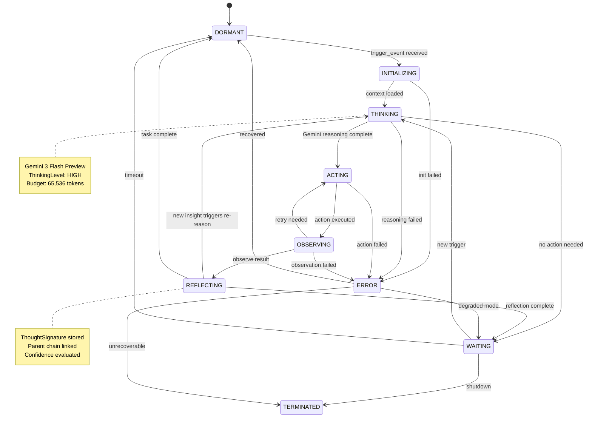

---

## 14. The DEFCON Survival Protocol

The financial survival system for students operating on tight budgets — from working undergrads to international students on strict visa-tied scholarships:

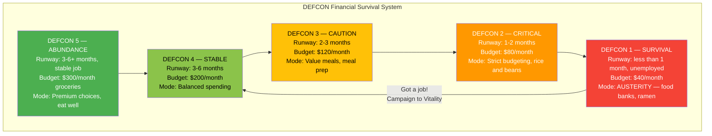

### Meal Decision Engine

Every meal decision factors in: **Time × Money × Energy**

```python
# Decision Matrix:
# ├── DEFCON 1-2 + Low Energy → EMERGENCY_FUEL (instant noodles, energy bar)
# ├── DEFCON 1-2 + Has Time   → COOK (rice & beans, eggs)
# ├── DEFCON 3-4 + Exam Mode  → CONVENIENCE (quick healthy options)
# ├── DEFCON 4-5 + Normal     → COOK or ORDER (balanced choices)
# └── Victory Feast unlocked  → ORDER (favorite restaurant)
```

### Emergency Fund & Auto-Save

- **Auto-save**: Configurable percentage split — half to emergency fund, half to savings
- **Emergency withdrawal**: Validated, tracked, triggers DEFCON recalculation
- **Shopping lists**: Pre-computed per DEFCON level ($40/$80/$120/$200/$300 budgets)

---

## 15. Function Calling & Tool System

Kaironex uses Gemini's native function calling with 10 specialized tool groups:

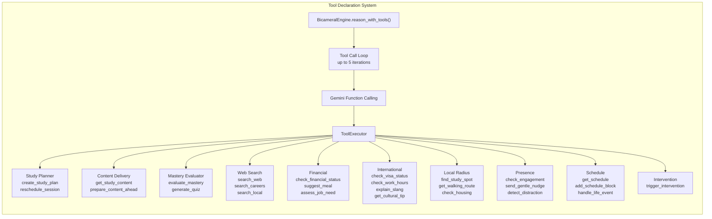

**Agent → Tool Mapping:**

| Agent | Tools Available |
|-------|----------------|
| Study Brain | Planner + Content + Mastery + Search + Presence |
| Campaign Brain | Search + Schedule + Intervention |
| Vitality Brain | Financial + Local Radius + Presence + Schedule |
| Radius Brain | Local Radius + International + Search |
| Supervisor | **ALL 10 tool groups** |

---

## 16. Live API Voice Integration

The mobile app connects to `gemini-2.5-flash-native-audio-preview-12-2025` via WebSocket (Gemini Live API) for real-time voice interaction. The **backend generates the system prompts** that control what the Voice Engine does.

> **Important:** The Live API is available on `gemini-2.5-flash-native-audio-preview-12-2025` only. It is NOT available on `gemini-3-flash-preview`. The backend (this codebase) uses `gemini-3-flash-preview` for all reasoning. The mobile app uses the native-audio model specifically for voice.

### How It Works

```
BACKEND                          MOBILE APP
───────                          ──────────
Campaign Agent                   Voice Engine
  design_interview() ──────►     (Live API WebSocket)
  Generates system prompt         gemini-2.5-flash-native-audio
  with interviewer persona,      Student speaks → AI responds
  question bank, difficulty       in real-time voice
  level, evaluation criteria

Radius Agent                     Voice Engine
  live_agent_prompt() ──────►    (Live API WebSocket)
  Generates teaching prompt       Cultural practice via voice
  with topic, language level,     Student practices ordering food,
  correction style                talking to professors, etc.

  cultural_scenario() ──────►    Voice Engine
  Generates scenario prompt       Role-play scenarios via voice
  with setting, characters,       Student navigates real-world
  objectives, success criteria    situations with AI partner

Study Agent                      Voice Engine
  (content prep) ──────────►     (Live API WebSocket)
  Topic material + quiz data      AI tutors student on topic
                                  via real-time conversation
```

The backend is the **brain**. The Voice Engine is the **mouth**. The backend decides WHAT to teach/practice/ask. The Voice Engine delivers it in real-time voice.

---

## 17. Database Schema — 20 Living Collections

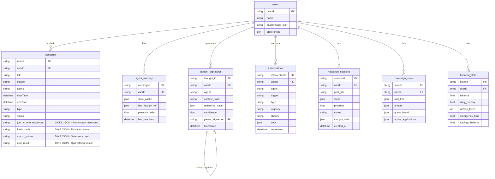

**All 20 Collections:**

| Collection | Purpose |
|-----------|---------|
| `users` | Core user data + state JSON |
| `agent_memory` | Living agent state per user (fast lookup) |
| `thought_signatures` | Permanent thought chain ledger |
| `interventions` | AI-generated push notifications/actions |
| `marathon_sessions` | Long-running task tracking |
| `campaign_state` | Career agent state (skill tree, quests) |
| `financial_state` | DEFCON system financial data |
| `vitality_state` | Health/energy/meal state |
| `radius_state` | Cultural progress + safehouses |
| `schedule` | Student schedule entries + JIT content fields |
| `study_logs` | Study session telemetry |
| `daily_snapshots` | End-of-day summaries |
| `policy_episodes` | RL-style policy learning data |
| `resources` | Uploaded learning materials |
| `monthly_plans` | Monthly planning data |
| `student_profiles` | Learned student personality/patterns |
| `life_events` | Life event records |
| `schedule_changes` | Schedule modification history |
| `international_info` | Visa, work hours, cultural data |
| `concept_mastery` | Per-concept mastery tracking |

---

## 18. Project Structure

```
Kaironex-Brain/
├── src/
│   ├── main.py                          # Appwrite Functions entry point
│   ├── config.py                        # Centralized configuration
│   ├── orchestrator.py                  # Agent orchestration
│   ├── agents/
│   │   ├── study_agent.py               # Academic strategist (1,263 lines)
│   │   ├── vitality_brain_v2.py         # Life logistics engine (1,650 lines)
│   │   ├── campaign_agent.py            # Career strategist (950 lines)
│   │   ├── radius_agent.py              # Cultural survival engine (868 lines)
│   │   ├── supervisor_agent.py          # Meta-controller (730 lines)
│   │   ├── main_brain.py               # Supervisor runner
│   │   ├── study_brain.py              # Study event processor
│   │   ├── campaign_brain.py           # Campaign event processor
│   │   ├── radius_brain.py             # Radius event processor
│   │   ├── vitality_agent_v2.py        # Vitality adapter
│   │   └── base_agent.py              # Base agent class
│   ├── core/
│   │   ├── bicameral_engine.py          # Dual-process reasoning (564 lines)
│   │   ├── cross_agent_integration.py   # Agent communication
│   │   ├── deep_brain.py              # Deep reasoning interface
│   │   ├── event_bus.py               # Pub/sub event system
│   │   ├── intervention_engine.py     # Intervention creation
│   │   ├── life_event_handler.py      # Major life event processing
│   │   ├── marathon_runner.py         # Long-running operation manager
│   │   ├── schedule_validator.py      # Schedule integrity checks
│   │   ├── state_machine.py           # Shared state context
│   │   ├── student_growth_engine.py   # Growth tracking
│   │   ├── survival_protocol.py       # Financial survival system
│   │   └── thought_manager.py         # Thought chain management
│   ├── tools/
│   │   ├── proactive_content_engine.py  # JIT content generation (839 lines)
│   │   ├── daily_content_generator.py   # Gatekeeper quiz + flashcards
│   │   ├── content_delivery.py        # Content delivery
│   │   ├── deep_research.py           # Research capabilities
│   │   ├── financial_survival.py      # Financial calculations
│   │   ├── international_student.py   # International student tools
│   │   ├── local_radius.py           # Location-based tools
│   │   ├── mastery_evaluator.py      # Quiz/mastery evaluation
│   │   ├── presence_engagement.py    # Engagement tracking
│   │   ├── search_tools.py           # Search capabilities
│   │   ├── study_planner.py          # Planning utilities
│   │   ├── tool_declarations.py      # Tool definitions
│   │   └── tool_executor.py          # Tool execution
│   └── utils/
│       ├── db_helper.py               # Appwrite database helper
│       ├── gemini_client.py           # Gemini API client
│       └── rate_limited_client.py     # Rate limiting
├── tests/
│   ├── test_all_agents.py             # Master test runner (149 tests)
│   ├── test_campaign_brain.py         # Campaign agent tests (27 tests)
│   ├── test_vitality_brain.py         # Vitality brain tests (39 tests)
│   ├── test_study_brain.py            # Study brain tests (26 tests)
│   ├── test_radius_brain.py           # Radius brain tests (57 tests)
│   ├── test_survival_protocol.py      # Survival protocol tests
│   ├── test_mocks.py                 # Shared mock classes
│   ├── test_endpoint.py              # Endpoint integration test
│   ├── test_god_mode.py              # God mode test
│   ├── test_resume_local.py          # Resume upload test
│   └── test_schedule_generation.py   # Schedule generation test
├── docs/
│   ├── ARCHITECTURE.md
│   ├── Architecture_APP_KMP.md
│   ├── AGENT_HANDOFF.md
│   ├── DEPLOYMENT_CHECKLIST.md
│   ├── FUNCTION_README.md
│   ├── KAIRONEX_APP_BLUEPRINT.md
│   ├── STUDY_SYSTEM_ARCHITECTURE.md
│   └── VITALITY_UI_DESIGN.md
├── main.py                            # Root entry point
├── requirements.txt                   # Python dependencies
├── appwrite.json                      # Appwrite deployment config
├── BACKEND_ARCHITECTURE.md           # This file
├── README.md
└── LICENSE
```

---

## 19. Test Suite & Judge Testing Guide

### 19.1 Offline Tests — 149 Tests, No API Keys Required

The entire brain system is testable offline without API keys or database access:

```
python tests/test_all_agents.py
```

| Suite | Tests | Assertions | Coverage |
|-------|-------|-----------|----------|
| Radius Brain | 17 tests | 57 ✅ | All 12 handlers + edge cases |
| Vitality Brain | 20 tests | 39 ✅ | All 20+ handlers + DEFCON + marathon |
| Study Brain | 9 tests | 26 ✅ | Focus drop, quiz gate, resource ingestion |
| Campaign Brain | 12 tests | 27 ✅ | ATS, resume gen, interview, skill tree |
| **Total** | **58 tests** | **149 ✅** | **All agents, all handlers** |

**Mock Infrastructure** (`tests/test_mocks.py`):
- `MockDBHelper`: 25+ in-memory database methods, full state persistence
- `MockGeminiClient`: Deterministic keyword-based responses (no API needed)
- `MockBicameralEngine`: Async reasoning mock with `MockReasoningResult`
- `MockContext` / `MockRes` / `MockReq`: Appwrite function context simulation

```bash
# Run individual suites
python tests/test_radius_brain.py      # 57/57 PASS
python tests/test_vitality_brain.py    # 39/39 PASS
python tests/test_study_brain.py       # 26/26 PASS
python tests/test_campaign_brain.py    # 27/27 PASS

# Run everything
python tests/test_all_agents.py        # 149/149 PASS  🎉
```

### 19.2 Live Testing with Gemini API (For Judges)

> **API credentials are provided in the hackathon submission form.** No secrets are stored in this repository.

#### Quick Start

```bash
# 1. Clone and install
git clone https://github.com/AliHaider0343/Kaironex-Brain.git
cd Kaironex-Brain
python -m venv .venv
.venv\Scripts\activate          # Windows
pip install -r requirements.txt

# 2. Set environment variables (values from hackathon submission)
$env:GEMINI_API_KEY="<from_submission>"
$env:APPWRITE_ENDPOINT="<from_submission>"
$env:APPWRITE_PROJECT_ID="<from_submission>"
$env:APPWRITE_API_KEY="<from_submission>"
$env:APPWRITE_DATABASE_ID="<from_submission>"

# 3. Run live tests
python tests/test_endpoint.py           # Full Appwrite Function endpoint
python tests/test_resume_local.py       # Resume ATS scoring with real Gemini
python tests/test_schedule_generation.py  # Semester schedule with 65,536 thinking tokens
```

#### What to Verify

| Test | What It Proves |
|------|----------------|
| `test_all_agents.py` | All 5 brains route correctly, ThoughtSignatures are created, errors handled gracefully — **no API needed** |
| `test_endpoint.py` | Full Appwrite Function endpoint responds to HTTP, database events, and CRON triggers |
| `test_schedule_generation.py` | Two-layer hierarchical planning generates semester strategy + daily tasks in one API call at 65,536 thinking tokens |
| `test_resume_local.py` | Campaign Agent scores resumes against job descriptions using real Gemini reasoning |
| `test_survival_protocol.py` | DEFCON system calculates budgets, fridge vision parses images, meal decisions factor time × money × energy |

#### What to Look For in Appwrite DB

If connected to the live Appwrite instance, inspect these collections:

- **`thought_signatures`** — Every agent call writes a `ThoughtSignature` with `model`, `thinking_tokens_used`, `reasoning_trace`, and `timestamp`. Proves all agents actually use `gemini-3-flash-preview` with thinking.
- **`interventions`** — Marathon-generated proactive actions (schedule adjustments, survival alerts, study nudges).
- **`agent_memory`** — Cross-session memory that persists student context across marathon runs.
- **`student_context`** — Student profile with DEFCON level, budget, schedule, and cultural metadata.

---

<div align="center">

**Built with Gemini 3 Flash Preview + Gemini 2.5 Flash Native Audio**  
**Kotlin Multiplatform (Mobile) + Python/Appwrite (Backend)**

*Kaironex closes the Prompt Gap — acting when students can't ask, so short-term overload never becomes permanent loss.*

</div>
